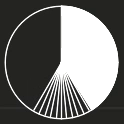

# time-visualization

> Develop the app for window such that visualizing the flow of time using time library.


# Final result



Minute: The white area

Second: The white line segment

# Motivation

I want to increase my concentration on my work. So I decided to check the time I concentrate on it. And then I figure out I have to maintain my mental at least one hours.

# Algorithm


### Get an global time

Get the global time using time library. We can earn second and minute using the global time.

```jsx
tm = time.time()
t_sec = round(tm % 60)
t_min = round((tm / 60 ) % 60)
```

### Convert to angle

After converting to second and minute, we have to parameterize the angle by the time. Notice that we will using radian method.

`second angle`:  $(sec * 6) * (\pi / 360 )$

`minute angle`:  $(min * 6) * (\pi / 360 )$

### Convert to coordinate

Then calculate each coordinate to draw line.

`x_s` : $\sin(second\ angle) * radian$

`y_s`: $-\cos(second\ angle) * radian$

`x_m` : $\sin(minute\ angle) * radian$

`y_m`: $-\cos(minute\ angle) * radian$

### Visualization

I used the PySide6 library to draw the figure. If you want to specific codes, I recommend to refer to above GitHub.

I appended the trace of coordinate to the history. And draw time segment for all the history. So that I can maintain the past second line.

```jsx
for h_x, h_y in self.sec_histroy:
    painter.drawLine(0, 0, h_x, h_y)
painter.drawLine(0, 0, x, y)

self.sec_histroy.append([x, y])
```

If the second run all cycle, we have to initialize it. It means we have to clear the history.

```python
if t_sec == 59:
		self.sec_histroy = []
```

I append more window’s function such as 

- Remove title
- Place on the top
- Not on the taskbar
- Mouse move event
- Mouse press event

# Future Works


- Time Setting: User can setting the whole time. Then I should be act as timer.
- Alert Feature: If the time done, there should be alert feature using sound or color.